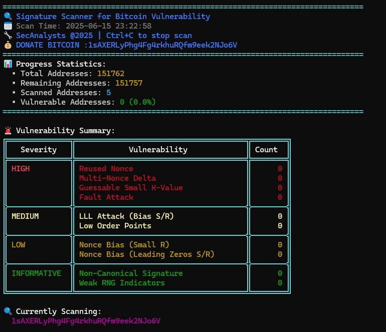

# SSBV - Signature Scanner for Bitcoin Vulnerabilities

**SSBV (Signature Scanner for Bitcoin Vulnerabilities)** is a Python-based tool that analyzes Bitcoin transactions to detect cryptographic weaknesses in ECDSA signatures. It supports multiple address formats (P2PKH, P2SH, SegWit) and integrates several blockchain explorers to retrieve and analyze transaction data in real-time.

---

## 🧠 Features

- 🔍 Reused Nonce Detection  
- 🧮 Guessable Small K-Value Recovery  
- 📊 Statistical Bias Detection (Small R/S, Leading Zeros)  
- 🔁 Multi-Nonce Delta Heuristics  
- ⚠️ LLL Attack Indicators  
- 💥 Fault Attack Detection  
- ✅ Non-Canonical Signature Warnings  
- 🧪 Full Z (sighash) Recalculation  
- 🌐 Multi-API Fallback  
  *(Blockchain.info, Mempool.space, Blockstream.info, SoChain, BTC.com)*

---

## 🖼️ Preview

Here's how the terminal-based interface of SSBV looks during a scan:



---

## 🛠 Requirements

- Python 3.12 or higher  
- Required libraries (install via pip):

```bash
pip install requests ecdsa pycryptodome
```

---

## 🚀 Usage

Run the tool with:

```bash
python ssbv.py
```

> ⚠️ Before running, ensure you review and optionally modify the code to target specific Bitcoin addresses or transaction limits.

---

## 📌 Notes

- This tool interacts with public blockchain APIs — use responsibly.
- Analysis includes full ECDSA component breakdown (`r`, `s`, `z`) and signature type detection (e.g. `P2PKH`, `P2WPKH`, multisig).
- Advanced detection features include:
  - Fault injection signs  
  - Canonical signature enforcement  
  - Nonce reuse and small-k attacks

---

## 💰 Donate

If you find this project valuable and would like to support my child's education and future endeavors, consider:

**Education Fund Bitcoin (BTC):**

```
1sAXERLyPhg4Fg4rkhuRQfm9eek2NJo6V
```

---

## 👨‍💻 Author

**Sec Analysts**  
🔒 Bitcoin security enthusiast  
🏆 Hall of Fame: Google, Microsoft, Apple, eBay, and more

---

## 📜 License

This project is licensed under the MIT License. See [LICENSE](LICENSE) for details.

---

## ⚠️ Legal Disclaimer

This project is intended **solely for educational and research purposes**.

- Do **not** use this tool against systems or addresses you do not own or have explicit permission to analyze.
- The developer of this tool is **not responsible** for any misuse, illegal activity, or damage caused by this script.
- You are fully responsible for complying with your local laws and regulations regarding cryptography, data access, and security analysis.

By using this project, you agree to use it **ethically and legally**.

---

